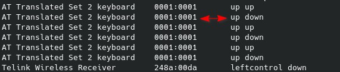

# Debian 12 Wayland keyboard configuration with keyd

### Preparation

```bash
    sudo apt install cmake libudev-dev
    git clone https://github.com/rvaiya/keyd
    cd keyd
    make && sudo make install
    sudo systemctl enable keyd && sudo systemctl start keyd
```

### Find the device and key you want to change
1. Use the command `sudo keyd monitor`
2. Press the key you want to configure
3. Get the device ID and the key codename



### Create a configuration file(<insert-name>.conf) to mapped keyd folder(/etc/keyd)

```bash
    sudo nano /etc/keyd/ATTranslatedSet2keyboard.conf
```
## Demo to disable up arrow key from laptop built-in keyboard
```
    [ids]

    0001:0001

    [main]

    up = noop
```  

### After configaration file is finished

```bash
    sudo systemctl restart keyd
```

## Test to verify it works
## Useful information at:
1. https://github.com/rvaiya/keyd
2. https://github.com/rvaiya/keyd/blob/master/docs/keyd.scdoc
